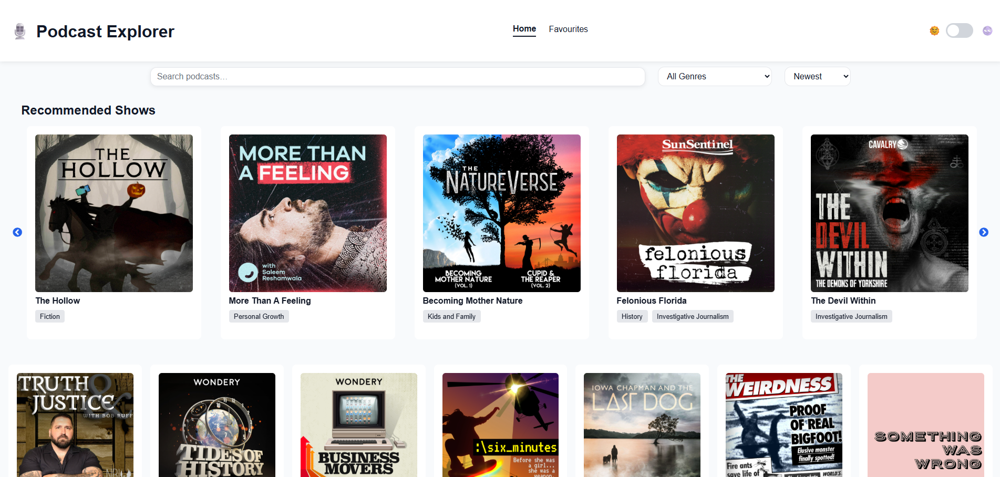
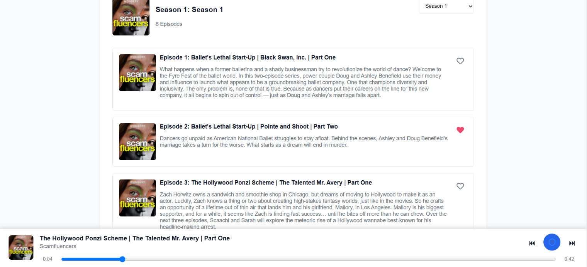

# 🎧 Podcast Explorer

A modern React podcast application that allows users to discover, explore and listen to podcasts with a seamless audio experience. Users can browse shows, search and filter content, favourite episodes, switch between light and dark themes, and continue listening while navigating throughout the application.

This project was built as the final portfolio piece for the CodeSpace DJS React module and focuses on building a polished, production-ready application using modern React best practices.

---

## 🌐 Live Demo

**Live Website:** https://podcast-explorer-navy.vercel.app/

**GitHub Repository:** https://github.com/mughammadcase/MUGCAS25563_PTO2508_Mughammad_Case_DJSPP.git

---

## 📸 Screenshots

### Landing Page



### Podcast Details Page



---

# ✨ Features

## 🎙 Podcast Discovery

- Browse podcast previews
- View detailed podcast information
- Explore individual seasons
- Browse every episode within a season

---

## 🔎 Search, Filter & Sort

- Search podcasts by title
- Filter podcasts by genre
- Sort podcasts:
  - Title A–Z
  - Title Z–A
  - Recently Updated
  - Least Recently Updated

---

## ❤️ Favourites

- Favourite and unfavourite episodes
- Persistent favourites using Local Storage
- Dedicated favourites page
- Episodes grouped by podcast
- Display:
  - Podcast title
  - Season
  - Episode
  - Date favourited
- Sort podcast groups alphabetically
- Sort episodes by:
  - Episode title A–Z
  - Episode title Z–A
  - Newest Added
  - Oldest Added
- Use separate sort controls for podcast groups and episode lists for clearer browsing

---

## 🎧 Global Audio Player

- Fixed audio player available on every page
- Continue playback while navigating
- Play / Pause controls
- Seek through episodes
- Playback progress tracking
- Confirmation prompt before leaving while audio is playing

---

## 🎠 Recommended Shows

- Horizontally scrolling recommendations carousel
- Infinite looping
- Navigation arrows
- Podcast artwork
- Genre tags
- Direct navigation to podcast details

---

## 🌙 Theme Toggle

- Light / Dark mode
- Theme preference saved in Local Storage
- Persistent across browser sessions
- Consistent styling throughout the application

---

## 📱 Responsive Design

Designed to work across:

- Mobile
- Tablet
- Desktop

Responsive layouts have been implemented throughout the application using CSS Modules and media queries.

---

# 🛠 Tech Stack

## Frontend

- React
- JavaScript (ES6+)
- CSS Modules
- Vite

---

## State Management

- React Context API
- React Hooks
  - useState
  - useEffect
  - useContext

---

## Storage

- Local Storage
  - Theme persistence
  - Favourite persistence

---

## Deployment

- Vercel

---

# 📁 Project Structure

```
src
│
├── api
├── assets
├── components
│   ├── Controls
│   ├── Feedback
│   ├── Filters
│   ├── Media
│   ├── Podcasts
│   └── UI
│
├── context
├── pages
├── utils
├── data.js
├── App.jsx
└── main.jsx
```

The project follows a modular component-based architecture, making it easier to maintain, scale and reuse components.

---

# 🚀 Installation

Clone the repository

```bash
git clone https://github.com/mughammadcase/MUGCAS25563_PTO2508_Mughammad_Case_DJSPP.git
```

Navigate into the project

```bash
cd MUGCAS25563_PTO2508_Mughammad_Case_DJSPP
```

Install dependencies

```bash
npm install
```

Start the development server

```bash
npm run dev
```

Build for production

```bash
npm run build
```

Preview the production build

```bash
npm run preview
```

---

# 🧠 React Concepts Demonstrated

This project demonstrates:

- Component-based architecture
- Context API
- Custom hooks
- React Router
- State management
- Conditional rendering
- Dynamic routing
- Reusable UI components
- Local Storage persistence
- Responsive design
- CSS Modules
- Separation of concerns

---

# 💡 Development Decisions

Some notable implementation decisions include:

- **Context API** was used to manage global state for audio playback, favourites and theme management.
- **CSS Modules** were chosen to provide locally scoped styles and improve maintainability.
- **Local Storage** persists favourites and theme preferences across browser sessions.
- **Reusable components** were created for buttons, filters, audio controls and UI elements to reduce duplication and improve consistency.
- **Component organisation** follows a feature-based folder structure for easier navigation and scalability.

---

# 👨‍💻 Author

**Mughammad Case**

Junior Software Developer

GitHub: https://github.com/mughammadcase

LinkedIn: https://linkedin.com/in/mughammad-case-56a940232
